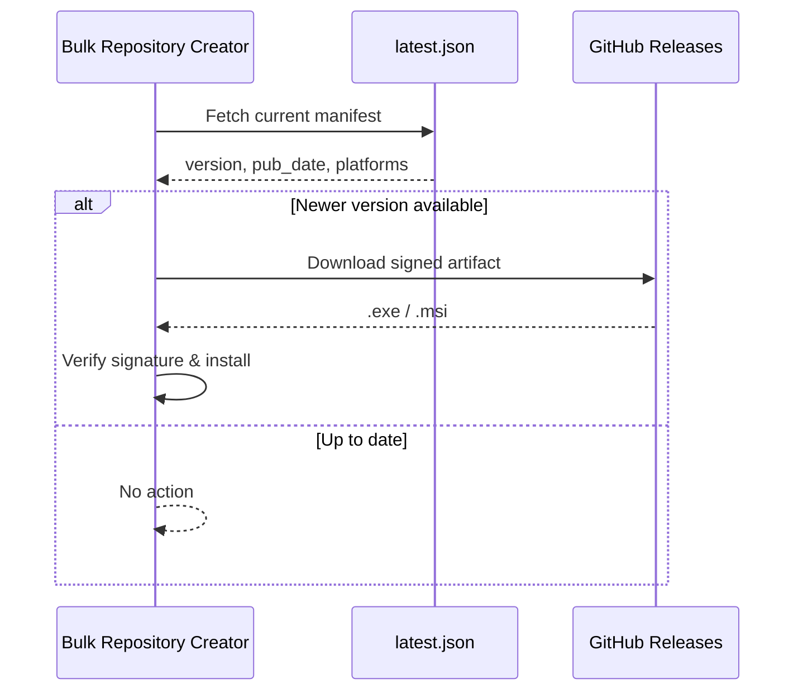

# Bulk Repository Creator — Update Manifests

[License: MIT](LICENSE)

Release metadata and Tauri auto-update manifests for **[Bulk Repository Creator](https://github.com/ankhangbc2021-oss/App-create-repo)** — a desktop application for creating and managing GitHub repositories in bulk.

This repository does **not** contain application source code. It tracks versioned release artifacts, checksums, and the `latest.json` manifest consumed by the in-app updater. Binaries (`.exe`, `.msi`) are published to [GitHub Releases](https://github.com/ankhangbc2021-oss/App-create-repo/releases) on the main application repository.

---

## About the Application

Bulk Repository Creator is a cross-platform desktop app built with **Tauri** and a **Node.js** background service. It helps developers and teams spin up many GitHub repositories quickly, with sensible defaults and visibility controls.


| Capability        | Description                                                                      |
| ----------------- | -------------------------------------------------------------------------------- |
| **Bulk creation** | Create multiple repositories from a single workflow                              |
| **GitHub sync**   | Real-time repository list with sorting, filtering, and manual refresh            |
| **Private repos** | Full support for private repository visibility via Octokit                       |
| **History**       | Searchable, sortable, filterable creation history with browser links             |
| **Localization**  | English and Vietnamese UI                                                        |
| **Auto-updates**  | Built-in Tauri updater (manual check: **Settings → System → Check for Updates**) |
| **Settings**      | Client settings persisted via SQLite through the background service              |


---

## Current Release


| Field         | Value          |
| ------------- | -------------- |
| **Version**   | `1.1.0`        |
| **Published** | 2026-07-18     |
| **Platform**  | Windows x86_64 |


See [CHANGELOG.md](CHANGELOG.md) and [releases/latest/release-notes.md](releases/latest/release-notes.md) for full release notes.

### Download

Installers are hosted on the main application repository:


| Artifact                      | Use case                            |
| ----------------------------- | ----------------------------------- |
| `Bulk Repository Creator.exe` | Portable / multi-language installer |
| `Bulk Repository Creator.msi` | Standard Windows Installer (MSI)    |


Download the latest build from the [v1.1.0 release page](https://github.com/ankhangbc2021-oss/App-create-repo/releases/tag/v1.1.0).

---

## Repository Layout

```
.
├── releases/
│   ├── latest/                 # Active manifest — what the app checks for updates
│   │   ├── latest.json         # Tauri updater manifest (version, URLs, signatures)
│   │   ├── VERSION             # Plain-text version string
│   │   ├── checksums.txt       # SHA-256 hashes for release artifacts
│   │   ├── release-notes.md    # Human-readable changelog for this version
│   │   ├── README.md           # Per-release upload instructions
│   │   └── LICENSE             # License bundled with the release
│   └── archive/
│       ├── v1.0.0/             # Frozen metadata for v1.0.0
│       └── v1.1.0/             # Frozen metadata for v1.1.0
├── CHANGELOG.md                # Project-wide version history
├── CONTRIBUTING.md             # How to cut and publish a release
├── SECURITY.md                 # Update signing and vulnerability reporting
├── LICENSE
└── README.md
```

The `releases/latest/` directory is the **source of truth** for the running updater. When you ship a new version, update `latest/`, then copy the previous version into `releases/archive/<version>/` before publishing.

---

## Auto-Update Flow

Bulk Repository Creator uses the [Tauri updater](https://v2.tauri.app/plugin/updater/). On each update check, the app fetches `latest.json` and compares the `version` field against the installed build.




Each platform entry in `latest.json` includes:

- `**url**` — Direct download link to the release artifact on GitHub
- `**signature**` — Minisign-compatible signature produced by the Tauri signing key (required for automatic installation)

Example structure:

```json
{
  "version": "1.1.0",
  "pub_date": "2026-07-05T10:01:12Z",
  "notes": "Release v1.1.0. Check release-notes.md for more details.",
  "platforms": {
    "windows-x86_64": {
      "url": "https://github.com/ankhangbc2021-oss/App-create-repo/releases/download/v1.1.0/Bulk%20Repository%20Creator.exe",
      "signature": "<minisign-signature>"
    }
  }
}
```

---

## Verifying Downloads

Every release includes SHA-256 checksums in `checksums.txt`. Verify a downloaded file before installing:

**PowerShell (Windows)**

```powershell
Get-FileHash "Bulk Repository Creator.exe" -Algorithm SHA256
```

**Linux / macOS**

```bash
shasum -a 256 "Bulk Repository Creator.exe"
```

Compare the output against the hash listed in [releases/latest/checksums.txt](releases/latest/checksums.txt):

```
24C472812F6E3A39E5B38E4F801838D93C8843969BDF68F87CBA93EA8437F421  Bulk Repository Creator.exe
0AF7864BDB995B12A21AB8AA23C2D7A2B61A2FBB30832EFE7A9CED3CE133D920  Bulk Repository Creator.msi
```

---

## Related Repositories


| Repository                                                                                | Purpose                                                |
| ----------------------------------------------------------------------------------------- | ------------------------------------------------------ |
| [ankhangbc2021-oss/App-create-repo](https://github.com/ankhangbc2021-oss/App-create-repo) | Application source code and release binaries           |
| **This repository**                                                                       | Update manifests, checksums, and release documentation |


---

## Contributing

See [CONTRIBUTING.md](CONTRIBUTING.md) for the release publishing workflow, manifest format requirements, and archiving conventions.

---

## Security

Signed updates and vulnerability reporting are documented in [SECURITY.md](SECURITY.md).

---

## License

This project is licensed under the [MIT License](LICENSE).

Copyright © 2026 Tang Manh Khang